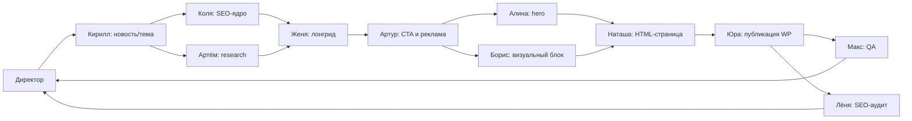

# Схема агентов Nero Network Office Page

Документ описывает роли, порядок запуска и файлы обмена для людей, которые устанавливают плагин в новый проект.

## Общая цепочка



Параллельные пары:

- `seo-kolya || artyom`
- `alina || boris`
- `qa || lenya`

Остальные этапы идут последовательно, потому что зависят от результатов предыдущих ролей.

## Роли

| Агент | Файл | Задача |
| --- | --- | --- |
| Директор | `agents/director.md` | Оркестрирует пайплайн, запускает роли, проверяет handoff и фрагменты. |
| Кирилл | `agents/kirill.md` | Ищет тему/новость дня, проверяет дубли и спрос. |
| Коля | `agents/seo-kolya.md` | Делает Wordstat/SEO-ядро, мета и структуру. Текст не пишет. |
| Артём | `agents/artyom.md` | Делает research, факты, источники, конкурентов. Текст не пишет. |
| Женя | `agents/zhenya.md` | Пишет лонгрид на основе SEO-ядра и research. |
| Артур | `agents/artur.md` | Добавляет CTA и рекламные блоки из env/secrets. |
| Алина | `agents/alina.md` | Делает только hero-секцию с анимацией. |
| Борис | `agents/boris.md` | Делает визуальный блок в теле статьи, не hero. |
| Наташа | `agents/natasha.md` | Собирает финальную HTML/PHP-страницу. |
| Юра | `agents/yura.md` | Публикует через FTP/SSH в активную тему WordPress. |
| Макс | `agents/qa.md` | Проверяет страницу в браузере, консоль, адаптив, alt/links. |
| Лёня | `agents/lenya.md` | Делает финальный SEO-аудит Google/Yandex/GEO. |

## Skills

Ключевые skills:

- `skills/director-nero-network/SKILL.md` — основной протокол пайплайна.
- `skills/news-scout-kirill/SKILL.md` — выбор темы.
- `skills/seo-agent-kolya/SKILL.md` — SEO и Wordstat.
- `skills/researcher-artyom/SKILL.md` — исследование.
- `skills/seo-writer-zhenya/SKILL.md` — лонгрид.
- `skills/advertiser-artur/SKILL.md` — CTA из env.
- `skills/animator-alina/SKILL.md` — hero.
- `skills/animator-boris/SKILL.md` — визуальный блок.
- `skills/designer-natasha/SKILL.md` — финальная верстка.
- `skills/publisher-yura/SKILL.md` — WordPress-публикация.
- `skills/qa-checker/SKILL.md` — QA.
- `skills/seo-auditor-lenya/SKILL.md` — SEO-аудит.
- `skills/indexlift-seo-auditor/` — локальный пакет для аудита.

## Handoff и фрагменты

Директор ведёт итоговый файл:

`<PROJECT_ROOT>/.cursor/nero-network-handoff.md`

Параллельные роли пишут во фрагменты:

`<PROJECT_ROOT>/.cursor/nero-network-fragments/`

Ожидаемые фрагменты:

- `kolya.md`
- `artyom.md`
- `alina.md`
- `boris.md`
- `qa.md`
- `lenya.md`

Директор переносит фрагменты в handoff строго в фиксированном порядке и проверяет, что нет дублей секций.

## Настройки сайта

Все данные конкретного сайта задаются через `.env`, `shared/hosting-credentials.local` или Cursor Cloud Secrets.

Обязательные переменные:

- `SITE_BRAND`
- `SITE_NICHE`
- `WP_SITE_URL`
- `PUBLIC_SITE_URL`
- `WP_THEME_SLUG`
- `REMOTE_SITE_ROOT`
- `FTP_HOST`, `FTP_USER`, `FTP_PASSWORD`
- `SSH_HOST`, `SSH_USER`, `SSH_PASSWORD`

Опциональные CTA:

- `PRIMARY_CTA_LABEL`, `PRIMARY_CTA_URL`
- `SECONDARY_CTA_LABEL`, `SECONDARY_CTA_URL`
- `AD_BANNER_URL`, `AD_BANNER_IMAGE_URL`, `AD_BANNER_ALT`

Проверка:

```powershell
python scripts/check-config.py --local
python scripts/check-config.py --local --network
```

## Правила безопасности

- Не хранить реальные доступы в репозитории.
- Не вставлять пароли в чат.
- Не коммитить `.env`, `shared/hosting-credentials.local`, ключи, `node_modules`, `deliverables`, `output`.
- Публикация страниц с `<script>` и `<canvas>` идёт через FTP/SSH в PHP-шаблон, не через WordPress REST API.

## Первый запуск

1. Установить плагин в Cursor.
2. Заполнить env/secrets.
3. Выполнить `scripts/check-config.py`.
4. Проверить тестовый шаблон `wordpress/page-nero-network-office-example.php`.
5. Запустить задачу: `Создай WordPress-страницу через Nero Network Office Page по теме: ...`.
